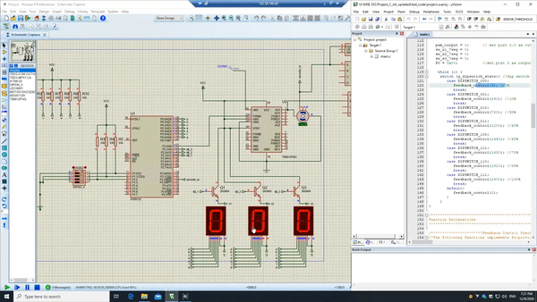
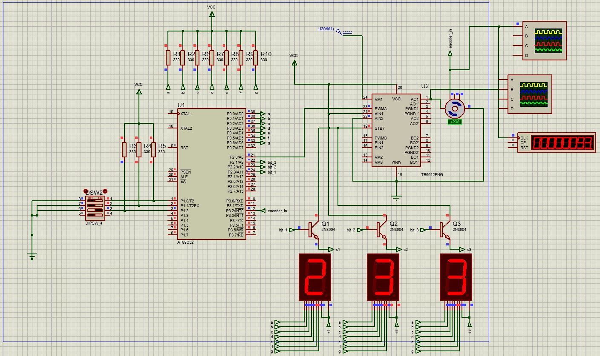
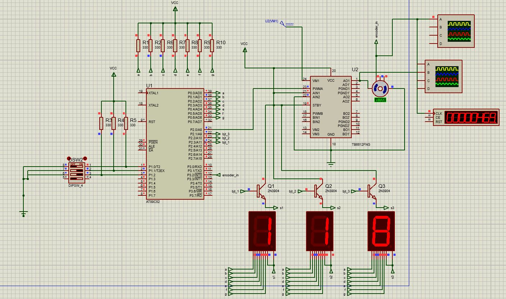
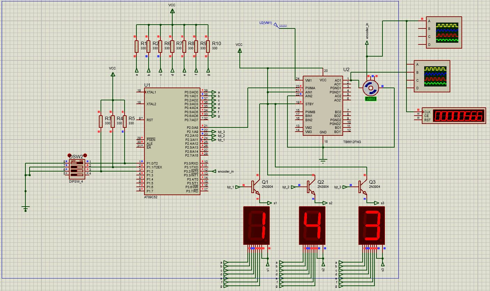

# DC-motor-controller-8051
## Demo ##
Circuit simulation in Proteus

## About ##
The goal of this project is to control an encoder motor using a feedback (proportional) control with 8051 microcontroller. The reference RPM is read from the dip switch, and output PWM of the motor is adjusted such that the current RPM reaches the reference RPM. The current speed in then displayed on three 7-segment display. 

The dipswitches are connected to P1.0, P1.1 and P1.2 of port 1, and encoder input is connected to P3.2 of port 3. While the PWM output, transistor switches, and 7 segment displays are connected to P2.0, P2.1, P2.2, P2.3 and port 0 respectively. The motor is controlled using diver IC for dual DC motor. The transistor switches are used to display first three digits of the current RPM of the motor on 7 segment using multiplexing techique.   
External interrupt routine is called whenever an external signal of falling edge is detected on pin 3.2. Wenever this routine is called, counter for falling edge is incremented by 1. This counter is used in 50ms internal interrupt routine to calculate the current RPM of the motor. The internal interrupt using Timer1 is configured for a periodic interrupt of 50ms. As per motor configuration, 24 falling edges represents 1 rotation, therefore using the recorded falling edges in 50ms, the current RPM can be caluclated. 

RPM = (X/0.05s * 60s/min)/24 = X * 50

where X is number of falling edges recorded in 50ms

Timer 0 of 8051 microcontroller is used to generate delay of 100us which is then used to created PWM output for motor control. A simple feedback control is used to calculated the error between current RPM and desired RPM (set using dipswitches), to adjust the PWM output. The snippets below shows the current RPM of DC motor for different desired input. 

### Dipswitch 0-0-1 [Desired RPM = 240] ###
The input RPM is 240, while the current RPM oscillates between 233 to 250

### Dipswitch 0-1-0 [Desired RPM = 720] ###
The input RPM is 720, while the current RPM oscillates between 718 to 733

### Dipswitch 0-1-1 [Desired RPM = 1200] ###
The input RPM is 1200, while the current RPM oscillates between 118x to 120x

Note: Only fisrt three digits of current RPM are displayed on 7 segments

### Dipswitch 1-0-0 [Desired RPM = 1440] ###
The input RPM is 1440, while the current RPM oscillates between 143x to 144x

Note: Only fisrt three digits of current RPM are displayed on 7 segments

